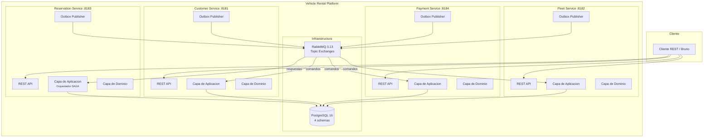
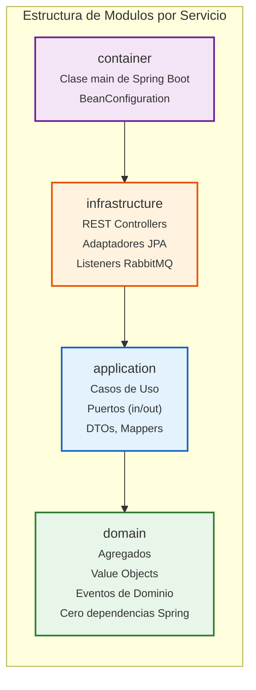
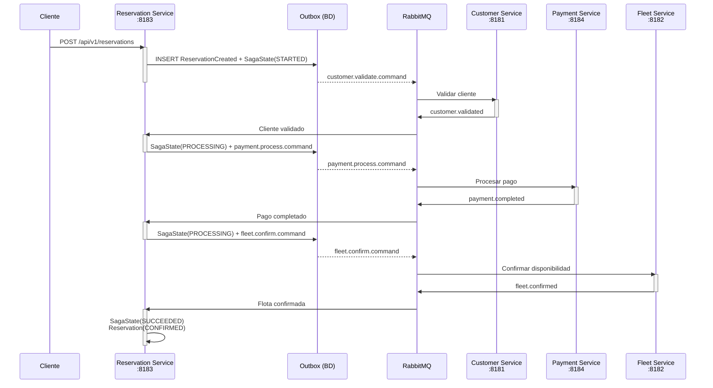
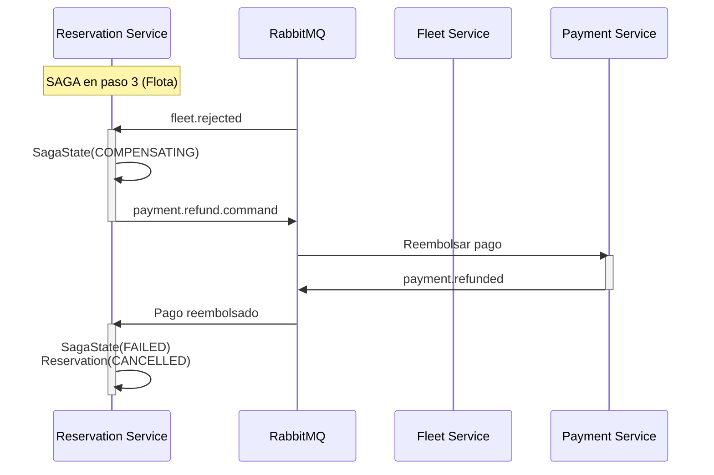
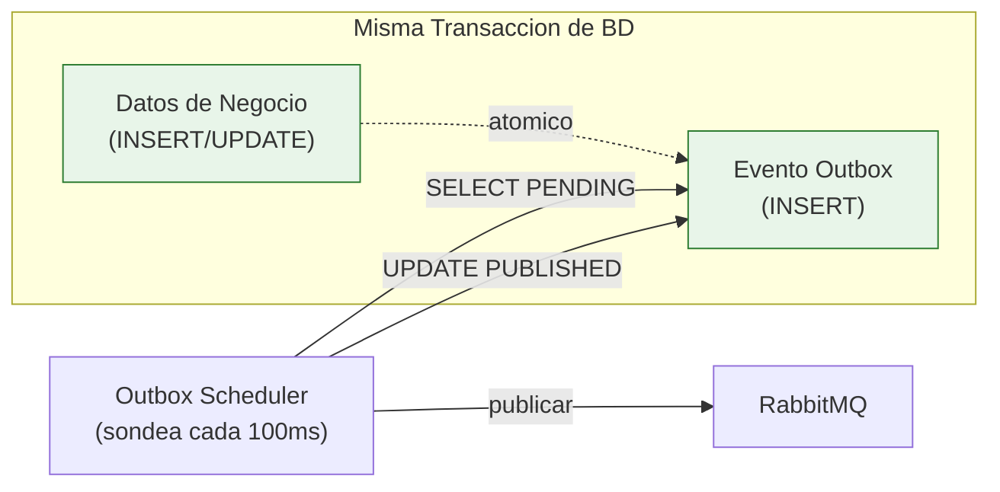
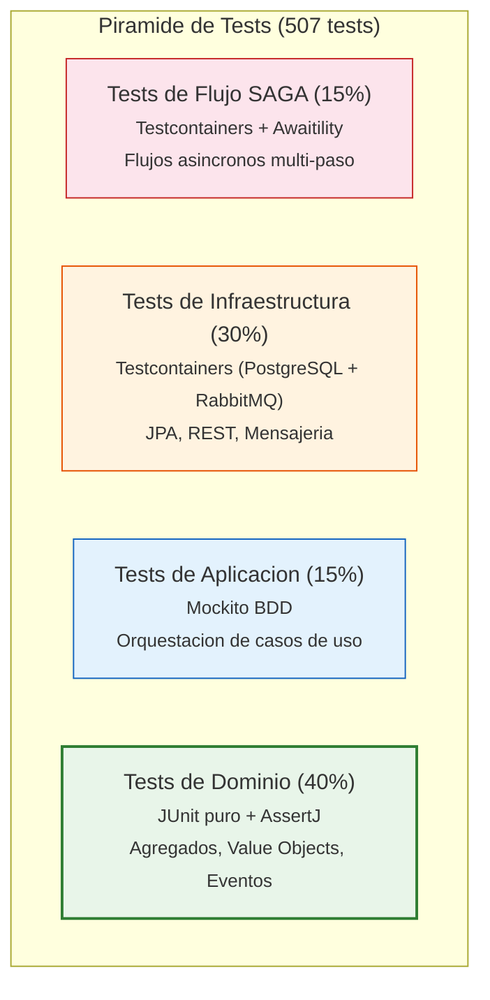
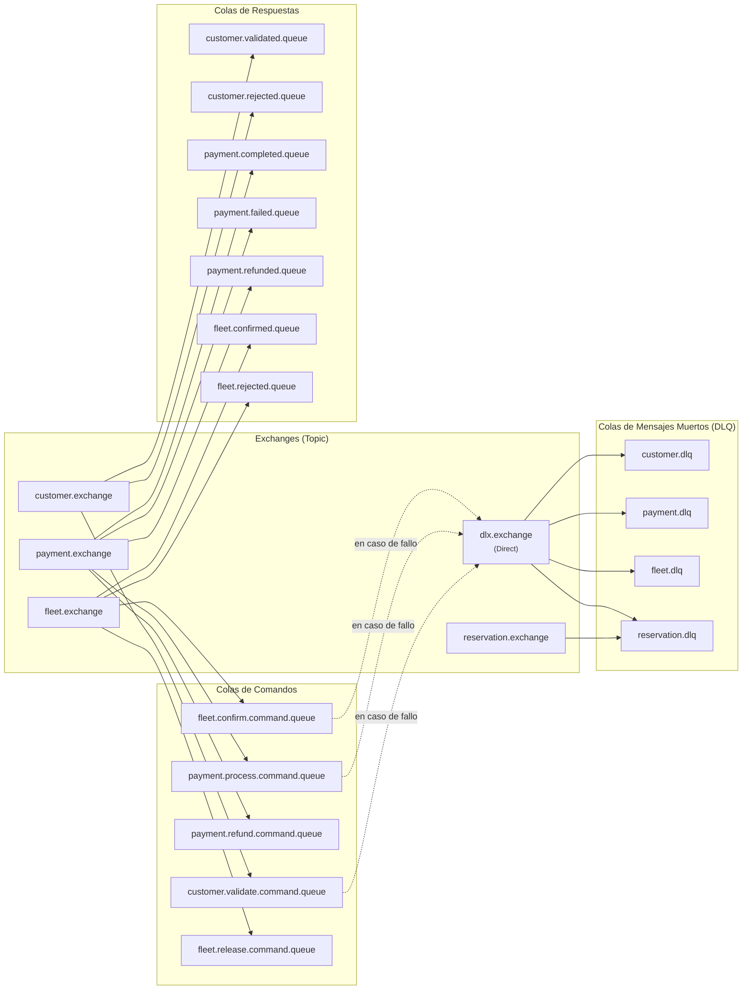
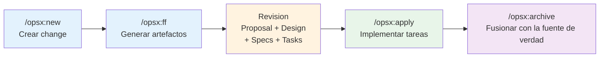

# Vehicle Rental Platform

**Plataforma de microservicios enterprise** que implementa Arquitectura Hexagonal, Orquestacion SAGA, Outbox Pattern y patrones tacticos de DDD sobre Java 21 + Spring Boot 3.4.

> POC de aprendizaje enfocado en la comprension profunda de patrones enterprise — no simplemente conseguir que el codigo compile.

[](#stack-tecnologico)
[](#stack-tecnologico)
[](#testing)
[](#cobertura-de-codigo)

---

## Tabla de Contenidos

- [Vision General de la Arquitectura](#vision-general-de-la-arquitectura)
- [Stack Tecnologico](#stack-tecnologico)
- [Estructura del Proyecto](#estructura-del-proyecto)
- [Los 4 Microservicios](#los-4-microservicios)
- [Flujo de Orquestacion SAGA](#flujo-de-orquestacion-saga)
- [Patron Outbox](#patron-outbox)
- [Referencia de APIs](#referencia-de-apis)
- [Swagger UI](#swagger-ui)
- [Tests E2E con Bruno](#tests-e2e-con-bruno)
- [Primeros Pasos](#primeros-pasos)
- [Ejecucion con Docker Compose](#ejecucion-con-docker-compose)
- [Ejecucion Local (sin Docker)](#ejecucion-local-sin-docker)
- [Testing](#testing)
- [Estrategia de Base de Datos](#estrategia-de-base-de-datos)
- [Topologia RabbitMQ](#topologia-rabbitmq)
- [Enforcement de Arquitectura](#enforcement-de-arquitectura)
- [Flujo de Desarrollo](#flujo-de-desarrollo)

---

## Vision General de la Arquitectura

Cada microservicio sigue una **Arquitectura Hexagonal estricta** (Puertos y Adaptadores) reforzada en tiempo de compilacion mediante modulos Maven y tests de ArchUnit.



### Aislamiento de Capas Hexagonales



Las dependencias siempre apuntan **hacia adentro**: `container -> infrastructure -> application -> domain`. El modulo de dominio tiene **cero dependencias de Spring** — Java puro.

---

## Stack Tecnologico

| Tecnologia | Version | Proposito |
|-----------|---------|---------|
| Java | 21 | Virtual Threads habilitados |
| Spring Boot | 3.4.13 | Framework base |
| Spring AMQP | gestionado por Boot | Integracion con RabbitMQ |
| Spring Data JPA | gestionado por Boot | Persistencia |
| Spring Boot Actuator | gestionado por Boot | Endpoints de salud |
| PostgreSQL | 16 | Base de datos (instancia unica, 4 schemas) |
| RabbitMQ | 3.13 | Broker de mensajeria + UI de gestion |
| Flyway | gestionado por Boot | Migraciones de base de datos |
| Lombok | gestionado por Boot | Reduccion de boilerplate |
| SpringDoc OpenAPI | 2.3.0 | Swagger UI + documentacion OpenAPI |
| Micrometer Tracing | gestionado por Boot | Distributed tracing (bridge OpenTelemetry) |
| OpenTelemetry OTLP | gestionado por Boot | Exportacion de traces |
| Grafana + Loki + Tempo + Prometheus | — | Stack de observabilidad (logs, traces, metricas) |
| Grafana Alloy | — | Agente de recoleccion (logs Docker + relay OTLP) |
| Bruno CLI | — | Tests E2E contra Docker Compose |
| Docker Compose | — | Orquestacion local |
| Paketo Buildpacks | — | Generacion de imagenes OCI (sin Dockerfiles) |
| JUnit 5 + Mockito + AssertJ | gestionado por Boot | Testing |
| Testcontainers | gestionado por Boot | Tests de integracion (PostgreSQL + RabbitMQ) |
| Awaitility | gestionado por Boot | Aserciones asincronas en tests |
| ArchUnit | 1.2.1 | Enforcement de boundaries arquitecturales |
| JaCoCo | 0.8.12 | Cobertura de codigo con umbrales obligatorios |
| Maven | 3.9+ | Build multi-modulo |

---

## Estructura del Proyecto

```
vehicle-rental-platform/
├── pom.xml                            # POM padre (20 modulos)
├── docker-compose.yml                 # Plataforma completa (infra + 4 servicios)
├── Makefile                           # Atajos de infraestructura
│
├── common/                            # Primitivas de dominio compartidas (cero Spring)
│   ├── AggregateRoot, BaseEntity      #   Clases base para todos los agregados
│   ├── DomainEvent, DomainException   #   Interfaz de eventos + jerarquia de excepciones
│   ├── Money                          #   Value object monetario
│   └── ApiResponse, ApiMetadata       #   Wrappers de respuesta REST
│
├── common-messaging/                  # Infraestructura del Patron Outbox
│   ├── OutboxEvent, OutboxPublisher   #   Entidad JPA + publicador a RabbitMQ
│   ├── OutboxCleanupScheduler        #   Limpieza de eventos publicados
│   └── MessageConverterConfig        #   Serializacion Jackson para RabbitMQ
│
├── reservation-service/               # Orquestador SAGA
│   ├── reservation-domain/            #   Agregado Reservation, SagaState, typed IDs
│   ├── reservation-application/       #   Orquestador SAGA, SagaSteps, casos de uso
│   ├── reservation-infrastructure/    #   REST + JPA + 7 listeners RabbitMQ
│   └── reservation-container/         #   App Boot, BeanConfiguration
│
├── customer-service/                  # Participante SAGA
│   ├── customer-domain/               #   Agregado Customer, reglas de validacion
│   ├── customer-application/          #   Caso de uso de validacion
│   ├── customer-infrastructure/       #   REST + JPA + listener de validacion
│   └── customer-container/
│
├── payment-service/                   # Participante SAGA
│   ├── payment-domain/                #   Agregado Payment, logica de reembolso
│   ├── payment-application/           #   Casos de uso de cobro + reembolso
│   ├── payment-infrastructure/        #   REST + JPA + listeners de pago
│   └── payment-container/
│
├── fleet-service/                     # Participante SAGA
│   ├── fleet-domain/                  #   Agregado Vehicle, disponibilidad
│   ├── fleet-application/             #   Casos de uso confirmar + liberar
│   ├── fleet-infrastructure/          #   REST + JPA + listeners de flota
│   └── fleet-container/
│
├── architecture-tests/                # Enforcement de boundaries hexagonales con ArchUnit
│
├── docker/
│   ├── postgres/init-schemas.sql      # 4 schemas + 4 usuarios (idempotente)
│   └── rabbitmq/
│       ├── definitions.json           # Exchanges, colas, bindings, DLQs
│       └── rabbitmq.conf
│
├── bruno/                             # Coleccion Bruno (API testing)
│   ├── e2e/happy-path/               #   E2E happy path SAGA
│   ├── e2e/compensation/             #   E2E compensation flow
│   └── {service}/                    #   Requests por servicio (exploracion manual)
│
├── docs/                              # 20 documentos de buenas practicas
│   ├── journal.md                     #   Diario de aprendizaje (30 ciclos)
│   └── roadmap.md                    #   Hoja de ruta y registro de decisiones
│
└── openspec/                          # Artefactos de Spec-Driven Development
    ├── project.md                     #   Vision general de arquitectura
    ├── specs/                         #   Fuente de verdad (80+ specs)
    └── changes/archive/              #   Changes completados (28 archivados)
```

---

## Los 4 Microservicios

| Servicio | Puerto | Rol | Responsabilidades Clave |
|----------|--------|-----|------------------------|
| **Reservation** | 8183 | Orquestador SAGA | Punto de entrada REST, crea reservas, orquesta la SAGA de 3 pasos, gestiona el ciclo de vida |
| **Customer** | 8181 | Participante SAGA | CRUD de clientes, valida elegibilidad para reservas (estado activo, carnet valido) |
| **Payment** | 8184 | Participante SAGA | Procesa pagos, soporta compensacion mediante reembolso |
| **Fleet** | 8182 | Participante SAGA | CRUD de vehiculos + ciclo de vida, confirma disponibilidad para fechas solicitadas |

---

## Flujo de Orquestacion SAGA

La plataforma implementa **SAGA basada en Orquestacion** (no Coreografia). El servicio de Reservas actua como coordinador central, enviando comandos y recibiendo respuestas via RabbitMQ.

### Camino Feliz (Happy Path)



### Flujo de Compensacion (Rechazo de Flota)

Cuando el servicio de flota rechaza una reserva (vehiculo no disponible), la SAGA lanza la compensacion automatica:



### Todos los Escenarios de Compensacion

| Punto de Fallo | Estado Previo | Compensacion | Estado Final |
|----------------|---------------|--------------|-------------|
| Validacion de cliente falla | PENDING | No necesaria | CANCELLED |
| Pago falla | CUSTOMER_VALIDATED | No necesaria | CANCELLED |
| Flota no disponible | PAID | Reembolso del pago | CANCELLED |

---

## Patron Outbox

Cada servicio persiste los eventos en una tabla `outbox_events` **dentro de la misma transaccion de base de datos** que los datos de negocio, eliminando el problema de dual-write.



**¿Por que Outbox?** Sin el, necesitarias actualizar la base de datos Y publicar en RabbitMQ — si cualquiera de los dos falla, el sistema queda en un estado inconsistente. El Outbox garantiza **entrega al menos una vez** (at-least-once delivery) con consistencia eventual.

---

## Referencia de APIs

### Reservation Service `:8183`

| Metodo | Endpoint | Descripcion |
|--------|----------|-------------|
| `POST` | `/api/v1/reservations` | Crear una nueva reserva (lanza la SAGA) |
| `GET` | `/api/v1/reservations/{trackingId}` | Consultar el estado de una reserva |

### Customer Service `:8181`

| Metodo | Endpoint | Descripcion |
|--------|----------|-------------|
| `POST` | `/api/v1/customers` | Registrar un nuevo cliente |
| `GET` | `/api/v1/customers/{id}` | Obtener detalles del cliente |
| `POST` | `/api/v1/customers/{id}/activate` | Activar cliente |
| `POST` | `/api/v1/customers/{id}/suspend` | Suspender cliente |
| `DELETE` | `/api/v1/customers/{id}` | Eliminar cliente |

### Fleet Service `:8182`

| Metodo | Endpoint | Descripcion |
|--------|----------|-------------|
| `POST` | `/api/v1/vehicles` | Registrar un nuevo vehiculo |
| `GET` | `/api/v1/vehicles/{id}` | Obtener detalles del vehiculo |
| `POST` | `/api/v1/vehicles/{id}/activate` | Activar vehiculo |
| `POST` | `/api/v1/vehicles/{id}/maintenance` | Enviar a mantenimiento |
| `POST` | `/api/v1/vehicles/{id}/retire` | Retirar vehiculo |

### Payment Service `:8184`

| Metodo | Endpoint | Descripcion |
|--------|----------|-------------|
| `POST` | `/api/v1/payments` | Procesar un pago |
| `POST` | `/api/v1/payments/refund` | Reembolsar un pago |
| `GET` | `/api/v1/payments/{id}` | Obtener detalles del pago |

### Health Check (todos los servicios)

| Metodo | Endpoint | Descripcion |
|--------|----------|-------------|
| `GET` | `/actuator/health` | Estado de salud del servicio |

---

## Swagger UI

Cada servicio expone documentacion OpenAPI interactiva con Swagger UI (springdoc-openapi, zero configuracion):

| Servicio | Swagger UI | API Docs (JSON) |
|----------|-----------|-----------------|
| Customer | http://localhost:8181/swagger-ui.html | http://localhost:8181/v3/api-docs |
| Fleet | http://localhost:8182/swagger-ui.html | http://localhost:8182/v3/api-docs |
| Reservation | http://localhost:8183/swagger-ui.html | http://localhost:8183/v3/api-docs |
| Payment | http://localhost:8184/swagger-ui.html | http://localhost:8184/v3/api-docs |

Los DTOs se documentan automaticamente por introspeccion de Java records — sin anotaciones `@Schema`.

---

## Tests E2E con Bruno

La carpeta [`bruno/`](bruno/README.md) contiene una coleccion [Bruno](https://www.usebruno.com/) versionable en Git con requests para los 4 servicios y dos flujos E2E automatizados:

```bash
# Instalar Bruno CLI
npm install -g @usebruno/cli

# Happy path — SAGA completa exitosamente (PENDING → CONFIRMED)
cd bruno
bru run --env local e2e/happy-path

# Compensation flow — fleet rechaza, payment se revierte (→ CANCELLED)
bru run --env local e2e/compensation
```

| Flujo | Requests | Assertions | Que valida |
|-------|----------|------------|-----------|
| `e2e/happy-path` | 4 | 6 | Customer → Vehicle → Reservation → CONFIRMED |
| `e2e/compensation` | 5 | 7 + 1 test | Customer → Vehicle → Maintenance → Reservation → CANCELLED + failureMessages |

Mas detalles en [`bruno/README.md`](bruno/README.md).

---

## Primeros Pasos

### Prerrequisitos

- **Java 21** (JDK)
- **Maven 3.9+**
- **Docker** (con Docker Compose)

### Inicio Rapido

```bash
# 1. Clonar el repositorio
git clone https://github.com/Cortadai/vehicle-rental-platform.git
cd vehicle-rental-platform

# 2. Compilar todos los modulos + ejecutar tests
mvn clean install

# 3. Construir imagenes OCI con Paketo Buildpacks
mvn spring-boot:build-image -DskipTests \
  -pl customer-service/customer-container,fleet-service/fleet-container,reservation-service/reservation-container,payment-service/payment-container

# 4. Arrancar la plataforma completa
docker compose up -d

# 5. Verificar que todos los servicios estan UP
curl http://localhost:8181/actuator/health  # Customer
curl http://localhost:8182/actuator/health  # Fleet
curl http://localhost:8183/actuator/health  # Reservation
curl http://localhost:8184/actuator/health  # Payment
```

---

## Ejecucion con Docker Compose

### Plataforma Completa (11 contenedores)

```bash
docker compose up -d
```

Esto arranca la infraestructura (PostgreSQL, RabbitMQ), los 4 microservicios y el stack de observabilidad (Grafana, Loki, Tempo, Prometheus, Alloy).

```
NOMBRE                       IMAGEN                                   PUERTO
vehicle-rental-postgres      postgres:16-alpine                       5432
vehicle-rental-rabbitmq      rabbitmq:3.13-management-alpine          5672, 15672
vehicle-rental-customer      vehicle-rental/customer-service:latest   8181
vehicle-rental-fleet         vehicle-rental/fleet-service:latest      8182
vehicle-rental-reservation   vehicle-rental/reservation-service:latest 8183
vehicle-rental-payment       vehicle-rental/payment-service:latest    8184
vehicle-rental-grafana       grafana/grafana:latest                   3000
vehicle-rental-loki          grafana/loki:latest                      3100
vehicle-rental-tempo         grafana/tempo:2.7.2                      3200
vehicle-rental-prometheus    prom/prometheus:latest                   9090
vehicle-rental-alloy         grafana/alloy:latest                     4317, 4318, 12345
```

### Solo Infraestructura

```bash
docker compose up postgres rabbitmq -d
```

Util cuando se ejecutan los servicios en local con `mvn spring-boot:run`.

### Interfaces de Gestion

| UI | URL | Credenciales |
|----|-----|--------------|
| RabbitMQ Management | http://localhost:15672 | guest / guest |
| Swagger UI (Customer) | http://localhost:8181/swagger-ui.html | — |
| Swagger UI (Fleet) | http://localhost:8182/swagger-ui.html | — |
| Swagger UI (Reservation) | http://localhost:8183/swagger-ui.html | — |
| Swagger UI (Payment) | http://localhost:8184/swagger-ui.html | — |
| Grafana | http://localhost:3000 | admin / admin |
| Prometheus | http://localhost:9090 | — |
| Alloy | http://localhost:12345 | — |

### Operaciones con Contenedores

```bash
# Ver estado de los contenedores
docker compose ps

# Ver logs (modo seguimiento)
docker compose logs -f

# Ver logs de un servicio concreto
docker compose logs -f reservation-service

# Parar todo
docker compose down

# Parar + eliminar volumenes (reset completo)
docker compose down -v
```

### Atajos del Makefile

```bash
make infra-up       # Arrancar PostgreSQL + RabbitMQ
make infra-down     # Parar infraestructura
make infra-reset    # Eliminar volumenes + reiniciar (borrón y cuenta nueva)
make infra-status   # Ver estado de contenedores
make infra-logs     # Seguir logs de infraestructura
```

---

## Ejecucion Local (sin Docker)

Arranca la infraestructura primero y despues ejecuta los servicios individualmente:

```bash
# 1. Arrancar infraestructura
docker compose up postgres rabbitmq -d

# 2. Ejecutar un servicio concreto
cd reservation-service/reservation-container
mvn spring-boot:run

# O ejecutar desde la raiz del proyecto
mvn spring-boot:run -pl reservation-service/reservation-container
```

Cada servicio utiliza variables de entorno con valores por defecto adecuados para desarrollo local. Consulta el `application.yml` en cada modulo container.

---

## Testing

### Estrategia de Testing

La piramide de tests esta adaptada para arquitectura hexagonal + SAGA:



| Capa | Peso | Enfoque | Nomenclatura |
|------|------|---------|--------------|
| Dominio | 40% | **Test-First** (specs → tests → codigo) | `*Test.java` |
| Aplicacion | 15% | Test-After, mock de puertos de salida | `*Test.java` |
| Infraestructura | 30% | Test-After, Testcontainers | `*IT.java` |
| Flujos SAGA | 15% | Test-After, flujo asincrono completo | `*SagaIT.java` |

### Ejecutar Tests

```bash
# Solo tests unitarios (rapido, ~10s)
mvn test

# Tests unitarios + integracion (requiere Docker para Testcontainers, ~60s)
mvn verify

# Ejecutar tests de un servicio concreto
mvn verify -pl reservation-service/reservation-domain,reservation-service/reservation-application,reservation-service/reservation-infrastructure,reservation-service/reservation-container

# Ejecutar una clase de test concreta
mvn test -pl reservation-service/reservation-domain -Dtest=ReservationTest
```

### Cobertura de Codigo

JaCoCo esta **permanentemente activo** — no necesita perfil. La cobertura se verifica en cada build con umbrales diferenciados por capa arquitectural:

| Capa | Umbral | Justificacion |
|------|--------|---------------|
| Dominio + Common | 80% | Logica pura, facil de testear |
| Aplicacion | 75% | El mocking anade ceremonia |
| Infraestructura | 60% | Los tests con Testcontainers son costosos |
| Container | Excluido | Solo configuracion de Spring Boot, sin logica |

El enforcement de cobertura se ejecuta automaticamente con `mvn test` (datos unitarios) y `mvn verify` (datos combinados unitarios + IT).

### Tests de Integracion con Testcontainers

Los tests de integracion usan PostgreSQL y RabbitMQ **reales** via Testcontainers — sin mocks, sin H2:

```java
@SpringBootTest
@ActiveProfiles("test")
@Testcontainers
class ReservationPersistenceIT {

    @Container @ServiceConnection
    static PostgreSQLContainer<?> postgres = new PostgreSQLContainer<>("postgres:16-alpine");

    @Container @ServiceConnection
    static RabbitMQContainer rabbitMQ = new RabbitMQContainer("rabbitmq:3.13-management-alpine");

    // Los tests se ejecutan contra infraestructura real...
}
```

---

## Estrategia de Base de Datos

Instancia unica de PostgreSQL con aislamiento **schema-por-servicio**:

```mermaid
graph TB
    subgraph "PostgreSQL 16 — vehicle_rental_db"
        subgraph "schema customer"
            CT["customers"]
            CO["outbox_events"]
            CF["flyway_schema_history"]
        end
        subgraph "schema reservation"
            RT["reservations"]
            RI["reservation_items"]
            RS["saga_state"]
            RO["outbox_events"]
            RF["flyway_schema_history"]
        end
        subgraph "schema payment"
            PT["payments"]
            PO["outbox_events"]
            PF["flyway_schema_history"]
        end
        subgraph "schema fleet"
            FT["vehicles"]
            FO["outbox_events"]
            FF["flyway_schema_history"]
        end
    end

    CU["customer_user"] --> CT
    CU --> CO
    RU["reservation_user"] --> RT
    RU --> RI
    RU --> RS
    RU --> RO
    PU["payment_user"] --> PT
    PU --> PO
    FU["fleet_user"] --> FT
    FU --> FO
```



- Cada servicio tiene un **usuario de base de datos dedicado** con permisos restringidos a su propio schema
- **Flyway** gestiona las migraciones de forma independiente por servicio
- El script `init-schemas.sql` crea schemas y usuarios de forma idempotente en el primer arranque del contenedor

---

## Topologia RabbitMQ



- **Un exchange por servicio** (tipo topic)
- **Colas de comandos** para la comunicacion orquestador SAGA → participante
- **Colas de respuestas** para la comunicacion participante → orquestador
- **Colas de Mensajes Muertos (DLQ)** por servicio a traves de un `dlx.exchange` compartido
- Toda la topologia se precarga desde `docker/rabbitmq/definitions.json` al arrancar el contenedor

---

## Enforcement de Arquitectura

### Tests de ArchUnit

El modulo `architecture-tests` contiene **8 reglas de ArchUnit** que se ejecutan en cada build, reforzando las boundaries hexagonales en los 4 servicios:

| Clase de Test | Reglas | Que refuerza |
|--------------|--------|-------------|
| `DomainPurityTest` | 5 | El dominio no tiene dependencias de Spring, JPA, aplicacion, infraestructura ni mensajeria |
| `ApplicationIsolationTest` | 1 | La aplicacion solo depende de dominio, common, Java stdlib, Lombok, Spring TX, SLF4J, Jackson |
| `DependencyFlowTest` | 2 | El dominio nunca depende de app/infra; la aplicacion nunca depende de infra |

### Cobertura JaCoCo

Los umbrales de cobertura se verifican por modulo en cada build. Una sola linea sin cubrir por debajo del umbral **rompe el build**.

---

## Flujo de Desarrollo

Este proyecto utiliza **OpenSpec** — una herramienta de desarrollo guiado por especificaciones (SDD) que estructura los cambios en un flujo de trabajo:



Se han completado y archivado **30 changes**, desde la configuracion inicial del multi-modulo Maven hasta la orquestacion SAGA completa, tests E2E y documentacion OpenAPI.

### Documentacion del Proyecto

| Documento | Proposito |
|----------|---------|
| [`bruno/README.md`](bruno/README.md) | Guia de la coleccion Bruno: estructura, E2E happy path y compensation |
| [`docs/journal.md`](docs/journal.md) | Diario de aprendizaje con 30 ciclos de decisiones y lecciones aprendidas |
| [`docs/roadmap.md`](docs/roadmap.md) | Registro de decisiones arquitectonicas y hoja de ruta |
| [`docs/*.md`](docs/) | 20 guias de buenas practicas con ejemplos de codigo y checklists |
| [`openspec/project.md`](openspec/project.md) | Vision general de arquitectura y convenciones |
| [`openspec/specs/`](openspec/specs/) | 80+ especificaciones (fuente de verdad) |

---

## Licencia

Este proyecto es un POC de aprendizaje y no esta licenciado para uso en produccion.
